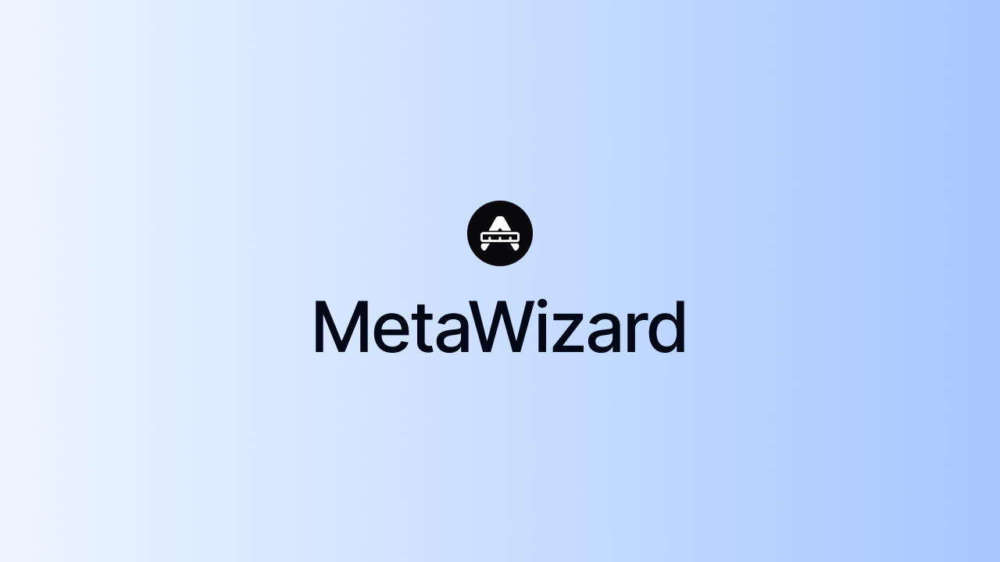

<a href="https://metawizard.vercel.app">
  
  <h1 align="center">MetaWizard</h1>
</a>

<p align="center">
  An open-source metadata builder tool for creating metadata and metadata file conventions for Next.js 13+ apps.
</p>

<p align="center">
  <a href="#introduction"><strong>Introduction</strong></a> ·
  <a href="#local-development"><strong>Local Development</strong></a> ·
  <a href="#tech-stack"><strong>Tech Stack</strong></a> ·
  <a href="#contributing"><strong>Contributing</strong></a>
</p>
<br/>

## Introduction

MetaWizard is an open-source metadata builder tool for creating metadata and metadata file conventions for Next.js 13+ apps.

## Local Development

To run the app locally, run the following commands:

```
pnpm i
pnpm build
pnpm dev
```

## Tech Stack

- [Next.js](https://nextjs.org/) – framework
- [Typescript](https://www.typescriptlang.org/) – language
- [Tailwind](https://tailwindcss.com/) – CSS
- [Vercel](https://vercel.com/) – deployments
